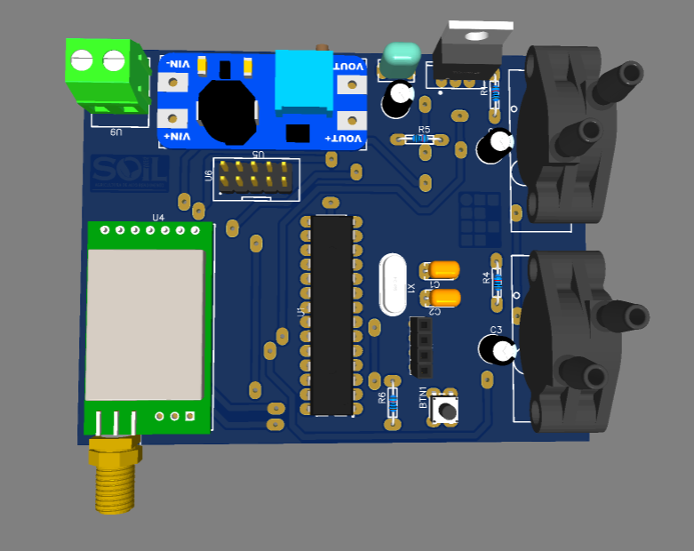
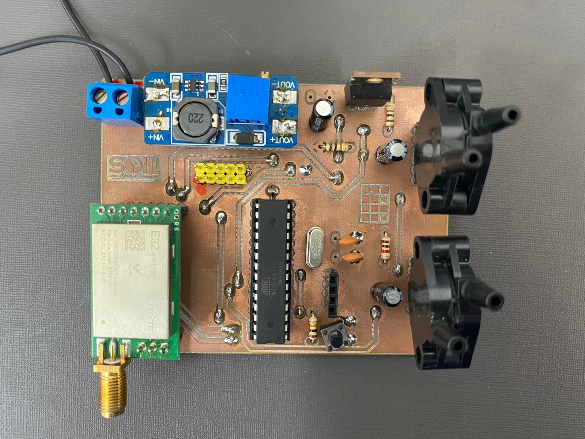
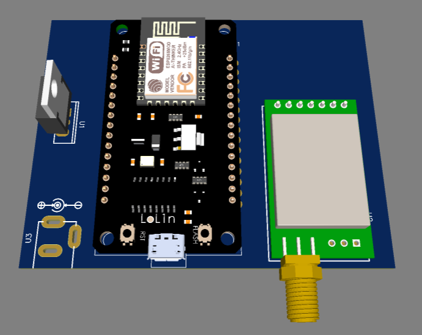
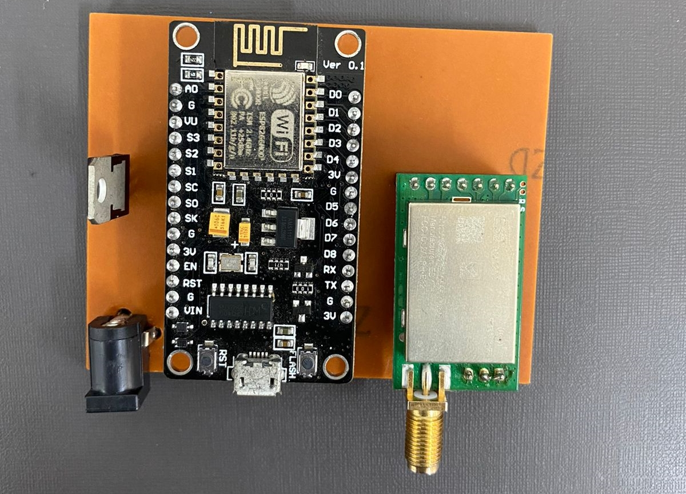
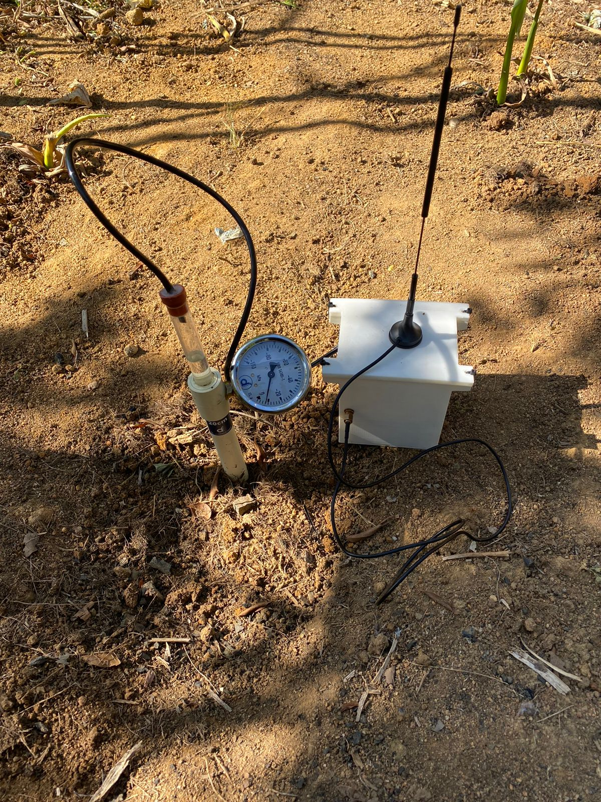

# Sistema de coleta automatizado de dados de tensiometria.
Projeto realizado no Ifes <i>Campus</i> Linhares em parceria com a empresa SOIL Agricultura de precisão, representada pelo seu fundador, Dr. Henrique de Sá Payer, coordenado pelo professor Dr. Erlon Cavazzana e com o apoio do professor Dr. Lucas Vago Santana. 
Início: 2021/2 
Fim: 2022/1 
 

O sistema consiste em utilizar conceitos de Iot, Agro 4.0, redes de sensores e outras tecnologias para desenvolver um sistema automatizado de coleta de dados tensiométricos para poder auxiliar a tomada de decisões sobre o momento correto de  irrigar e a quantidade correta de água a se aplicar na lavoura. 
 
O sistema contém um device que fica instalado no campo e  faz a coleta dos dados por meios de sensores, envia essas informações para outro device que fica em um lugar onde é possivel conectá-lo a internet. Essas informações são enviadas para um servidor e podem ser consultadas de qualquer lugar que tenha acesso a internet, permitindo uma vizualização quase em tempo real das condições hídricas do solo. 

 

 

 
